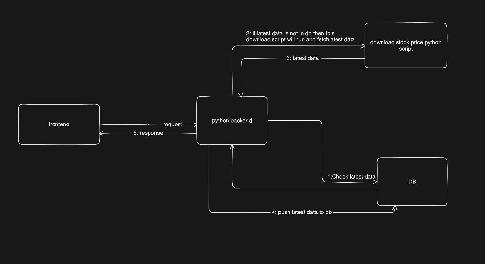
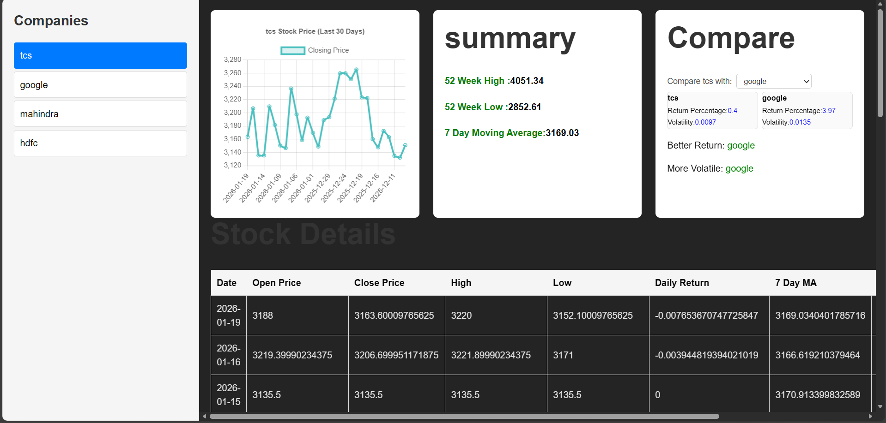

# Stock Data Intelligence

## DESIGN


## SWAGGER DOC


## UI


## Setup Instructions

### Prerequisites
- Python 3.8 or higher
- Node.js 16 or higher
- Git

### Backend Setup (Python/FastAPI)

1. Navigate to the backend directory:
   ```
   cd backend
   ```

2. Create a virtual environment:
   ```
   python -m venv venv
   ```

3. Activate the virtual environment:
   - On Windows:
     ```
     venv\Scripts\activate
     ```
   - On macOS/Linux:
     ```
     source venv/bin/activate
     ```

4. Install dependencies:
   ```
   pip install -r requirment.txt
   ```

5. Run the backend server:
   ```
   uvicorn app.main:app --reload
   ```

The backend will be running on `http://localhost:8000`. You can access the API documentation at `http://localhost:8000/docs`.

### Frontend Setup (React/Vite)

1. Navigate to the client directory:
   ```
   cd client
   ```

2. Install dependencies:
   ```
   npm install
   ```

3. Start the development server:
   ```
   npm run dev
   ```

The frontend will be running on `http://localhost:5173`.

### Running the Application

1. Start the backend server first (as described above).
2. Start the frontend development server (as described above).
3. Open your browser and navigate to `http://localhost:5173` to access the application.

The backend API is configured to allow requests from the frontend running on port 5173.

## Logic Explanation

### /summary/{symbol} - Stock Summary

This endpoint returns a summary for a given stock symbol, including the 52-week high, 52-week low, and average close price. The logic involves processing historical stock data using pandas DataFrames to compute various metrics.

#### Key Calculations:

1. **Daily Return**: 
   ```
   df["daily_return"] = (df["close"] - df["open"]) / df["open"]
   ```
   This calculates the daily return as the percentage change from open to close price for each trading day.

2. **7-Day Moving Average**:
   ```
   df["ma_7"] = df["close"].rolling(7).mean()
   ```
   Computes the 7-day simple moving average of closing prices to smooth out short-term fluctuations.

3. **52-Week High**:
   ```
   df["week52_high"] = df["high"].rolling(252).max()
   ```
   Finds the maximum high price over the last 252 trading days (approximately 52 weeks, assuming 5 trading days per week).

4. **52-Week Low**:
   ```
   df["week52_low"] = df["low"].rolling(252).min()
   ```
   Finds the minimum low price over the last 252 trading days. Note: The code appears to have a typo - it should use `df["low"]` instead of `df["high"]` for accuracy.

#### How It Achieves the Summary:
- The endpoint retrieves historical stock data for the symbol from the database.
- Applies these rolling calculations to identify key price levels and trends.
- Returns the most recent values for 52-week high, low, and the average of closing prices over the period.
- This provides investors with a quick overview of the stock's performance and volatility over the past year.

### /compare?symbol1=INFY&symbol2=TCS - Stock Comparison

This endpoint compares the performance of two stocks over a 30-day period, providing insights into both returns and volatility.

#### Stock Comparison Logic (30-Day Performance)

To compare the performance of two stocks, I use a 30-day historical window based on the most recent available trading days. This timeframe provides a short-term but meaningful view of how each stock has behaved recently, while avoiding long-term noise.

For each company, I retrieve the latest 30 trading days of stock data from the database, ordered by date. From this data, I compute two key metrics:

1. **Return Percentage (Performance)**

   The return percentage measures how much the stock's price has increased or decreased over the last 30 trading days.

   It is calculated using the closing prices:

   - The first closing price represents the price at the start of the 30-day window.
   - The last closing price represents the most recent price.

   **Formula used:**

   ```
   Return % = (Last Close − First Close) / First Close × 100
   ```

   This metric answers the question: "Which stock delivered better returns over the last 30 days?"

2. **Volatility (Risk)**

   Volatility represents how much the stock price fluctuates on a day-to-day basis, which is a proxy for risk.

   I calculate volatility as the standard deviation of daily returns over the same 30-day period.

   **Steps:**
   - Use the pre-computed daily_return values for each trading day.
   - Compute the mean of daily returns.
   - Calculate the variance.
   - Take the square root of the variance to get standard deviation.

   This metric answers the question: "Which stock is more volatile (riskier) over the last 30 days?"

3. **Comparison Logic**

   After computing both metrics for each stock:
   - Better performing stock → the one with the higher 30-day return percentage
   - More volatile stock → the one with the higher volatility value

   The API returns both the raw metrics and the comparison result so that the frontend or user can interpret the data transparently instead of relying on hardcoded conclusions.

#### Why This Approach
- Uses real historical data
- Balances performance (return) and risk (volatility)
- Simple, explainable, and aligned with real financial analysis
- Easy to extend to different time windows (e.g., 60 or 90 days)
